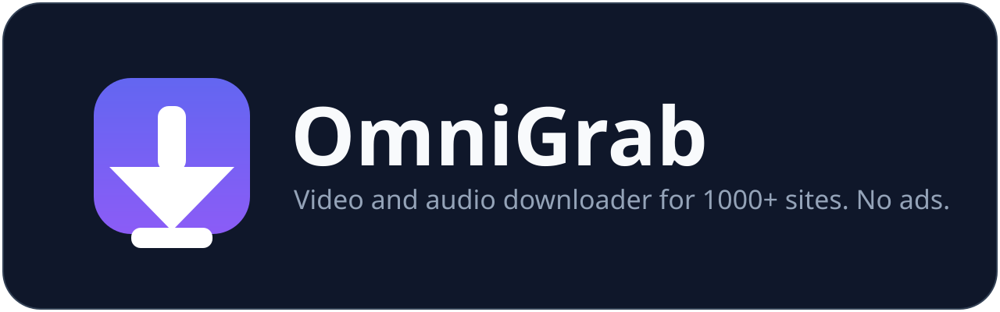
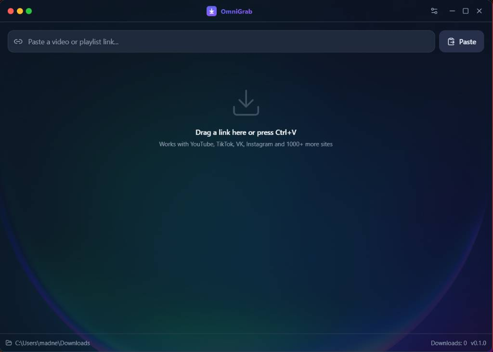
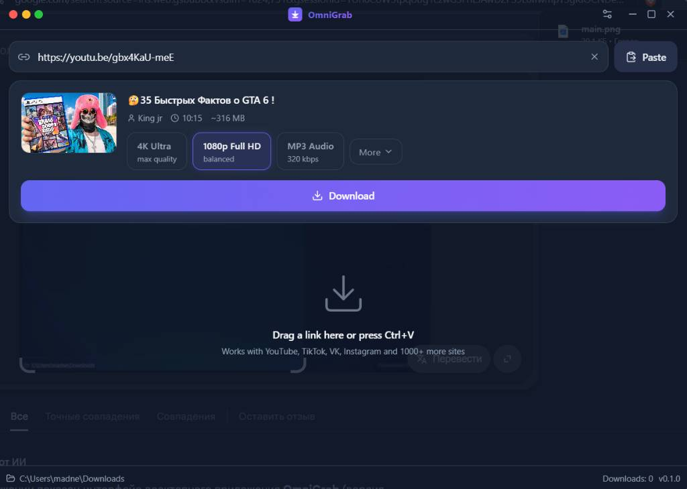
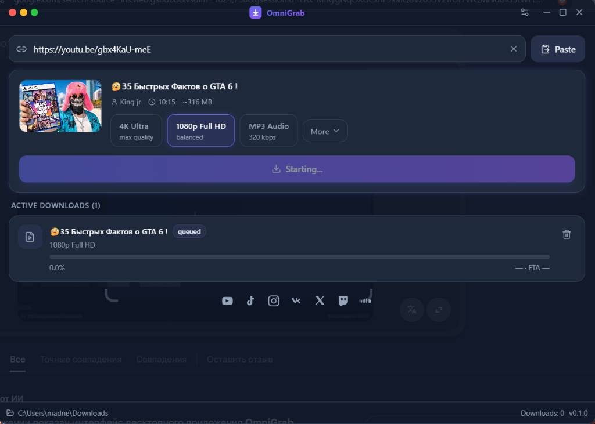

<p align="center">
  
</p>

<p align="center">
  <a href="https://github.com/MortisClub/OmniGrab/actions/workflows/release.yml"></a>
  <a href="https://github.com/MortisClub/OmniGrab/releases"></a>
  
  
</p>

<p align="center">Fast, minimal desktop app for downloading video and audio. Paste a link, hit Download, done.</p>

## Screenshots

<p align="center">
  
  
  
</p>

## Features

- Paste a link, get title, thumbnail and available formats in a second
- Presets: 4K Ultra, 1080p, MP3 320kbps, plus manual video+audio stream picker
- Live progress with speed and ETA, parallel downloads, cancel and retry
- Tray icon with background "download from clipboard"
- OS notification when a download finishes, reveal-in-folder button
- yt-dlp updates itself in the background, ffmpeg is fetched automatically

## Sites

YouTube, TikTok, VK, Instagram, X, Twitch, SoundCloud and 1000+ more through yt-dlp.

## Download

Grab the installer for your OS from the [Releases](https://github.com/MortisClub/OmniGrab/releases) page: `.exe` for Windows, `.dmg` for macOS (Intel and Silicon), `.AppImage` / `.deb` for Linux.

## Develop

```sh
npm install
npm run tauri dev
```

Windows needs the MSVC toolchain (stable Rust + VS Build Tools). First launch downloads yt-dlp into the app data dir.

```sh
npm run tauri build   # local installer
```

Pushing a `v*.*.*` tag builds all installers on CI and drafts a release.

## Stack

Tauri v2 (Rust) + React + TypeScript, Tailwind v4, zustand, framer-motion, lucide. Download engine: yt-dlp + ffmpeg.

```
src-tauri/src/ytdlp/   binary.rs (yt-dlp/ffmpeg management)
                       metadata.rs (fetch_metadata)
                       download.rs (queue, progress, cancel)
src/components/        URLInput, MediaCard, DownloadQueue, SettingsModal
src/stores/            downloads, settings
```

## License

MIT, see [LICENSE](LICENSE).
